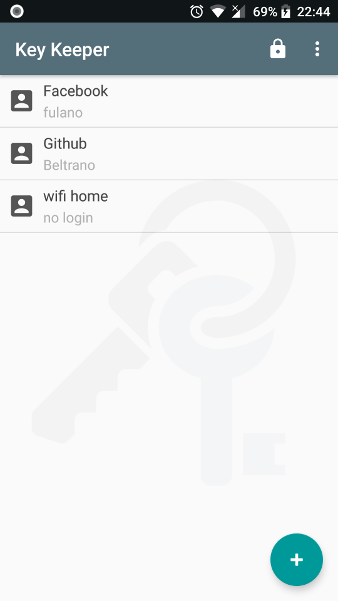

# Key Keeper

It is an Android application, developed in Java, that allows the user to maintain their bank of passwords in a mobile device. It is quite useful though it sounds dangerous.

> For *android 4.1 jelly bean* and higher versions

## About security

The user has the option to create a password to access the application. This prevents others from accessing the his/her bank of passwords.

Another security measure is the encryption key saved in the application that encrypts saved passwords in the bank.

The configuration of the encryption key is made in the file *CoderB64.java*. 

```java
private final String KEY = "YOUR_KEY";
```
## Importing and exporting informations

The application allows the user to import and export data through *.xls* files.

It is important that when importing records, the information is on the first page of sheet, located in the first three columns. As shown in the table below:

| Web site | Login | Password
|---|---|---|
| Facebook | fulano| myPassword
| Github | beltrano | 123456
| wifi | no login | ilovemyfamily

## Languages

* English *(default)*
* Brazilian Portuguese

## Goal

The goal is simple, the application needs improving and there is a lot to do ...

* adding features
* new languages
* security improvements
* bug fixes.
* and others...

> All help is welcome!

## Screenshots




## License

MIT

Copyright &copy; 2018 Samir Sales
